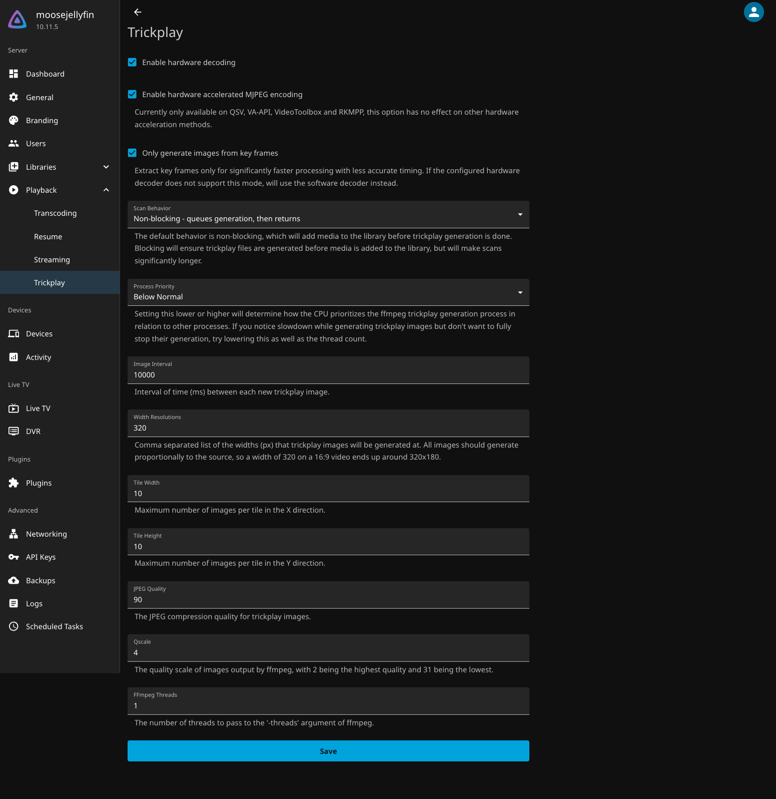

# Setup Guide

Everything you need to go from zero to streaming. Works on any NAS or Docker host.

## Table of Contents

- [Choose Your Setup](#choose-your-setup)
- [Requirements](#requirements)
- [Stack Overview](#stack-overview)
- [Step 1: Create Directories](#step-1-create-directories-and-clonefork-repository)
- [Step 2: Edit Your Settings](#step-2-edit-your-settings)
- [Step 3: Start the Stack](#step-3-start-the-stack)
- [Step 4: Configure Each App](#step-4-configure-each-app)
- [Step 5: Check It Works](#step-5-check-it-works)
- [+ local DNS (.lan domains)](#-local-dns-lan-domains--optional)
- [+ remote access](#-remote-access--optional)
- [Backup](#backup)
- [Optional Utilities](#optional-utilities)

---

## Choose Your Setup

Decide how you'll access your media stack:

| Setup | How you access | What to configure | Good for |
|-------|----------------|-------------------|----------|
| **Core** | `192.168.1.50:8096` | Just `.env` + VPN credentials | Testing, single user |
| **+ local DNS** | `jellyfin.lan` | Configure Pi-hole + add Traefik | Home/family use |
| **+ remote access** | `jellyfin.yourdomain.com` | Add Cloudflare Tunnel | Access from anywhere |

**You can start simple and add features later.** The guide has checkpoints so you can stop at any level.

---

## Requirements

Here's what you'll need to get started.

### Hardware
- **NAS** (Ugreen, Synology, QNAP, etc.) or any Linux server/Raspberry Pi 4+
- Minimum 4GB RAM (8GB+ recommended)
- Storage for media files

### Software & Services
- **Docker** - Preinstalled on UGOS; one-click install from app store on Synology/QNAP
- **SSH access** to your NAS (enable in NAS settings)
- **VPN Subscription** - Any provider supported by [Gluetun](https://github.com/qdm12/gluetun-wiki/tree/main/setup/providers) (Surfshark, NordVPN, PIA, Mullvad, ProtonVPN, etc.)

<details>
<summary><strong>Already using Tailscale?</strong></summary>

This stack has two different WireGuard components:

- **Gluetun's WireGuard** = VPN *client* that protects your downloads. You need this regardless of Tailscale.
- **WireGuard service** = VPN *server* for accessing your NAS remotely. Tailscale replaces this.

If you use Tailscale: skip the WireGuard *service* (the `WG_PASSWORD_HASH` stuff in `.env`). You still need your VPN provider's WireGuard credentials for Gluetun.

</details>

<details>
<summary><strong>New to Docker?</strong></summary>

**Docker** runs applications in isolated "containers" - like lightweight virtual machines. Each service (Jellyfin, Sonarr, etc.) runs in its own container.

**Docker Compose** lets you define multiple containers in a single file (`docker-compose.yml`) and start them all with one command. Instead of typing out dozens of options for each container, you just run `docker compose up -d`.

This stack uses Docker Compose because it has 10+ services that need to work together. The compose file defines how they're connected, what ports they use, and where they store data.

</details>

- **Usenet Provider** (optional, ~$4-6/month) - Frugal Usenet, Newshosting, Eweka, etc.
- **Usenet Indexer** (optional) - NZBGeek (~$12/year) or DrunkenSlug (free tier)

> **Why Usenet?** More reliable than public torrents (no fakes), faster downloads, SSL-encrypted (no VPN needed). See [SABnzbd setup](#45-sabnzbd-usenet-downloads).

**For + remote access:**
- **Domain name** (~$10/year) - [Cloudflare Registrar](https://www.cloudflare.com/products/registrar/) recommended
- **Cloudflare account** (free tier)

---

## Stack Overview

### What Each Component Does

| Component | What it does | Which setup? |
|-----------|--------------|--------------|
| **Jellyseerr** | Request portal - users request shows/movies here | Core |
| **Jellyfin** | Media player - like Netflix but for your own content | Core |
| **Sonarr** | TV show manager - searches for episodes, sends to download client | Core |
| **Radarr** | Movie manager - searches for movies, sends to download client | Core |
| **Prowlarr** | Indexer manager - finds download sources for Sonarr/Radarr | Core |
| **qBittorrent** | Torrent client - downloads files (through VPN) | Core |
| **Gluetun** | VPN container - routes download traffic through VPN so your ISP can't see what you download | Core |
| **Pi-hole** | DNS server - blocks ads, provides Docker DNS | Core |
| **WireGuard** | VPN server - full network access when away from home | + remote access |
| **Traefik** | Reverse proxy - enables `.lan` domains | + local DNS |
| **Cloudflared** | Tunnel to Cloudflare - secure remote access without port forwarding | + remote access |

### Files You Need To Edit

**Core:**
- `.env` - Media path, timezone, PUID/PGID, VPN credentials

**+ local DNS:**
- `.env` - Add NAS IP, Pi-hole password, Traefik macvlan settings

**+ remote access:**
- `.env` - Add domain, WireGuard password, Traefik dashboard auth
- `traefik/dynamic/vpn-services.yml` - Replace `yourdomain.com`

**Files you DON'T edit:**
- `docker-compose.*.yml` - Work as-is, configured via `.env`
- `pihole/02-local-dns.conf` - Generated from example via sed command
- `traefik/dynamic/tls.yml` - Security defaults
- `traefik/dynamic/local-services.yml` - Auto-generates from `.env`

### Docker Compose Files

| File | Purpose | Which setup? |
|------|---------|--------------|
| `docker-compose.arr-stack.yml` | Core media stack (Jellyfin, *arr apps, downloads, VPN) | Core |
| `docker-compose.traefik.yml` | Reverse proxy for .lan domains and external access | + local DNS |
| `docker-compose.cloudflared.yml` | Secure tunnel to Cloudflare (no port forwarding) | + remote access |
| `docker-compose.utilities.yml` | Monitoring, auto-recovery, disk usage | Utilities (optional) |

See [Quick Reference](REFERENCE.md) for full service lists, .lan URLs, and network details.

> **Prefer Plex?** Use `docker-compose.plex-arr-stack.yml` instead of `arr-stack` (untested).

---

## Step 1: Create Directories and Clone/Fork Repository

First, set up the folder structure for your media and get the files from this GitHub repo onto your NAS.

**Fork first (recommended):** Click "Fork" on GitHub, then clone your fork. This lets you add your own services, customise configs, and pull upstream updates when you want them.

> **Just want to try it?** You can clone this repo directly instead of forking. You'll still get updates via `git pull`, but can't push your own changes.

<details>
<summary><strong>Ugreen NAS (UGOS)</strong></summary>

Docker comes preinstalled on UGOS - no installation needed! Folders created via SSH don't appear in UGOS Files app, so create top-level folders via GUI.

1. Open UGOS web interface → **Files** app
2. Create shared folders: **Media**, **docker**
3. Inside **Media**, create subfolders: **downloads**, **tv**, **movies**
4. Enable SSH: **Control Panel** → **Terminal** → toggle SSH on
5. SSH into your NAS and install git:

```bash
ssh your-username@nas-ip

# Install git (Ugreen NAS uses Debian)
sudo apt-get update && sudo apt-get install -y git

# Clone the repo
cd /volume1/docker
sudo git clone https://github.com/Pharkie/arr-stack-ugreennas.git arr-stack  # or your fork
sudo chown -R 1000:1000 /volume1/docker/arr-stack
```

**Note:** Use `sudo` for Docker commands on Ugreen NAS. Service configs are stored in Docker named volumes (auto-created on first run).

</details>

<details>
<summary><strong>Synology / QNAP</strong></summary>

Use File Station to create:
- **Media** shared folder with subfolders: downloads, tv, movies
- **docker** shared folder

Then via SSH:
```bash
ssh your-username@nas-ip

# Install git if not present (Synology)
sudo synopkg install Git

# Clone the repo
cd /volume1/docker
sudo git clone https://github.com/Pharkie/arr-stack-ugreennas.git arr-stack  # or your fork
sudo chown -R 1000:1000 /volume1/docker/arr-stack
```

</details>

<details>
<summary><strong>Linux Server / Generic</strong></summary>

```bash
# Install git if needed
sudo apt-get update && sudo apt-get install -y git

# Create media directories
sudo mkdir -p /srv/media/{downloads,tv,movies}
sudo chown -R 1000:1000 /srv/media

# Clone the repo
cd /srv/docker
sudo git clone https://github.com/Pharkie/arr-stack-ugreennas.git arr-stack  # or your fork
sudo chown -R 1000:1000 /srv/docker/arr-stack
```

**Note:** Adjust paths in docker-compose files if using different locations. Service configs are stored in Docker named volumes (auto-created on first run).

</details>

### Expected Structure

```
/volume1/  (or /srv/)
├── Media/
│   ├── downloads/    # qBittorrent downloads
│   ├── tv/           # TV shows (Sonarr → Jellyfin)
│   └── movies/       # Movies (Radarr → Jellyfin)
└── docker/
    └── arr-stack/
        ├── traefik/              # + local DNS / + remote access only
        │   ├── traefik.yml
        │   └── dynamic/
        │       └── vpn-services.yml
        └── cloudflared/          # + remote access only
            └── config.yml
```

> Only `traefik/` and `cloudflared/` appear as folders on your NAS. Everything else is managed by Docker internally.

---

## Step 2: Edit Your Settings

The stack needs your media path, timezone, VPN credentials, and a few passwords. Everything goes in one `.env` file.

> **Note:** From this point forward, all commands run **on your NAS via SSH**. If you closed your terminal, reconnect with `ssh your-username@nas-ip` and `cd /volume1/docker/arr-stack` (or your clone location). **UGOS users:** SSH may time out—re-enable in Control Panel → Terminal if needed.

### 2.1 Copy the Main Configuration File

```bash
cp .env.example .env
```

### 2.2 Media Storage Path

Set `MEDIA_ROOT` in `.env` to match your media folder location:

```bash
# Examples:
MEDIA_ROOT=/volume1/Media     # Ugreen, Synology
MEDIA_ROOT=/share/Media       # QNAP
MEDIA_ROOT=/srv/media         # Linux server
```

Containers run as the user specified by PUID/PGID. This must match who owns your media folders:

```bash
# SSH to NAS, then run:
ls -ln /volume1/       # Shows folder owners as numbers (UID/GID)
id                     # Shows YOUR user's UID/GID - these should match
```

If wrong, you'll see errors like "Folder '/tv/' is not writable by user 'abc'" in Sonarr/Radarr.

### 2.3 Timezone

Set your timezone (used for scheduling, logs, and UI times):

```bash
TZ=Europe/London              # Find yours: https://en.wikipedia.org/wiki/List_of_tz_database_time_zones
```

### 2.4 Configure VPN

Add your VPN credentials to `.env`. Gluetun supports 30+ providers—find yours below:

<details>
<summary><strong>Surfshark (WireGuard)</strong></summary>

| Step | Screenshot |
|:-----|:-----------|
| 1. Go to [my.surfshark.com](https://my.surfshark.com/) → VPN → Manual Setup → Router → WireGuard |  |
| 2. Select **"I don't have a key pair"** |  |
| 3. Under Credentials, enter a name (e.g., `ugreen-nas`) |  |
| 4. Click **"Generate a new key pair"** and copy both keys to your notes |  |
| 5. Click **"Choose location"** and select a server (e.g., United Kingdom) |  |
| 6. Click the **Download** arrow to get the `.conf` file |  |

7. Open the downloaded `.conf` file and note the `Address` and `PrivateKey` values:
   ```ini
   [Interface]
   Address = 10.14.0.2/16
   PrivateKey = aBcDeFgHiJkLmNoPqRsTuVwXyZ...
   ```

8. Edit `.env`:
   ```bash
   VPN_SERVICE_PROVIDER=surfshark
   VPN_TYPE=wireguard
   WIREGUARD_PRIVATE_KEY=your_private_key_here
   WIREGUARD_ADDRESSES=10.14.0.2/16
   VPN_COUNTRIES=United Kingdom
   ```

> **Note:** `VPN_COUNTRIES` in your `.env` maps to Gluetun's `SERVER_COUNTRIES` env var.

</details>

<details>
<summary><strong>Other Providers (NordVPN, PIA, Mullvad, etc.)</strong></summary>

See the Gluetun wiki for your provider:
- [NordVPN](https://github.com/qdm12/gluetun-wiki/blob/main/setup/providers/nordvpn.md)
- [Private Internet Access](https://github.com/qdm12/gluetun-wiki/blob/main/setup/providers/private-internet-access.md)
- [Mullvad](https://github.com/qdm12/gluetun-wiki/blob/main/setup/providers/mullvad.md)
- [ProtonVPN](https://github.com/qdm12/gluetun-wiki/blob/main/setup/providers/protonvpn.md)
- [All providers](https://github.com/qdm12/gluetun-wiki/tree/main/setup/providers)

Update `.env` with your provider's required variables.

</details>

> **Don't want Pi-hole?** Change `DNS_ADDRESS=172.20.0.5` to your preferred public DNS (e.g., `1.1.1.1`, `8.8.8.8`) in `docker-compose.arr-stack.yml`.

### 2.5 Create Passwords

**Pi-hole Password:**

Invent a password. Or, to generate a random one:
```bash
openssl rand -base64 24
```
Edit `.env`: `PIHOLE_UI_PASS=your_password`

**For + remote access: WireGuard Password Hash**

> **Note:** WireGuard uses `wg.${DOMAIN}` as its hostname. You need the + remote access setup (with DOMAIN configured) for WireGuard to work. See [WireGuard VPN Server Setup](#wireguard-vpn-server-setup) for full instructions.

Invent a password for the WireGuard admin UI and note it down, then generate its hash:
```bash
docker run --rm ghcr.io/wg-easy/wg-easy wgpw 'your_chosen_password'
```
Copy the `$2a$12$...` hash output to `.env`:
```bash
WG_PASSWORD_HASH=$2a$12$your_generated_hash
```

**For + remote access: Traefik Dashboard Auth**

Invent a password for the Traefik dashboard and note it down, then generate the auth string:
```bash
docker run --rm httpd:alpine htpasswd -nb admin 'your_chosen_password' | sed -e s/\\$/\\$\\$/g
```
Copy the output to `.env`: `TRAEFIK_DASHBOARD_AUTH=admin:$$apr1$$...`

---

## Step 3: Start the Stack

Time to launch your containers and verify everything connects properly.

### 3.1 Create Docker Network

All services need to talk to each other. This creates a private network with fixed IP addresses so containers can always find each other.

<details>
<summary><strong>Retrying after a failed deployment?</strong></summary>

Clean up orphaned networks first:
```bash
# Check for orphaned networks
./scripts/check-network.sh

# Or clean all unused networks
docker network prune
```

</details>

```bash
docker network create \
  --driver=bridge \
  --subnet=172.20.0.0/24 \
  --gateway=172.20.0.1 \
  arr-stack
```

### 3.2 Deploy

```bash
# Create empty config file (+ local DNS users will overwrite this later)
touch pihole/02-local-dns.conf

docker compose -f docker-compose.arr-stack.yml up -d
```

> **Port 1900 conflict?** If you get "address already in use" for port 1900, your NAS's built-in media server is using it. Comment out `- "1900:1900/udp"` in the Jellyfin section of the compose file. Jellyfin works fine without it (only affects smart TV auto-discovery).

> **For + local DNS or + remote access:** Deploy Traefik in those sections.

### 3.3 Verify Deployment

```bash
# Check all containers are running
docker ps

# Check VPN connection
docker logs gluetun | grep -i "connected"

# Verify VPN IP (should NOT be your home IP)
docker exec gluetun wget -qO- ifconfig.me
```

---

## Step 4: Configure Each App

Your stack is running! Now configure each app to work together.

See **[Quick Reference → Service Connection Guide](REFERENCE.md#service-connection-guide)** for how services connect to each other.

### 4.1 Jellyfin (Media Server)

Streams your media library to any device.

1. **Access:** `http://NAS_IP:8096`
2. **Initial Setup:** Create admin account
3. **Add Libraries:**
   - Movies: Content type "Movies", Folder `/media/movies`
   - TV Shows: Content type "Shows", Folder `/media/tv`

<details>
<summary><strong>Hardware Transcoding (Intel Quick Sync) - Recommended for Ugreen</strong></summary>

Ugreen NAS (DXP4800+, etc.) have Intel CPUs with built-in GPUs. Enable this to use GPU-accelerated transcoding - reduces CPU usage from ~80% to ~20% when transcoding.

> **No Intel GPU?** Remove the `devices:` and `group_add:` lines (4 lines total) from the jellyfin service in `docker-compose.arr-stack.yml`, or Jellyfin won't start.

**1. Find your render group ID:**
```bash
# SSH to your NAS and run:
getent group render | cut -d: -f3
```

**2. Add to your `.env`:**
```bash
RENDER_GROUP_ID=105  # Use the number from step 1
```

**3. Recreate Jellyfin:**
```bash
docker compose -f docker-compose.arr-stack.yml up -d jellyfin
```

**4. Configure Jellyfin:** Dashboard → Playback → Transcoding


**Key settings:**
- **Hardware acceleration:** Intel QuickSync (QSV)
- **Enable hardware decoding for:** H264, HEVC, MPEG2, VC1, VP8, VP9, HEVC 10bit, VP9 10bit
- **Prefer OS native DXVA or VA-API hardware decoders:** ✅
- **Enable hardware encoding:** ✅
- **Enable Intel Low-Power H.264/HEVC encoders:** ✅
- **Allow encoding in HEVC format:** ✅
- **Enable VPP Tone mapping:** ✅

**5. Configure Trickplay:** Dashboard → Playback → Trickplay

Trickplay generates preview thumbnails when you hover over the video timeline.



**Enable these for GPU-accelerated thumbnail generation:**
- **Enable hardware decoding:** ✅
- **Enable hardware accelerated MJPEG encoding:** ✅
- **Only generate images from key frames:** ✅ (faster, minimal quality impact)

**6. Verify it's working:**

1. Click your user icon → **Settings** → **Playback**
2. Set **Quality** to a low value (e.g., 720p 1Mbps)
3. Play a video and open **Playback Info** (⚙️ → Playback Info)
4. Look for **"Transcoding framerate"** - should show **10x+ realtime** (e.g., 400+ fps)
5. Check CPU usage - should stay ~20-30% instead of 80%+

If transcoding framerate is only ~1x (24-30 fps), hardware acceleration isn't working.

</details>

### 4.2 qBittorrent (Torrent Downloads)

Receives download requests from Sonarr and Radarr and downloads files via torrents.

1. **Access:** `http://NAS_IP:8085`
2. **Get temporary password** (qBittorrent 4.6.1+ generates a random password):
   ```bash
   # Run this on your NAS via SSH:
   docker logs qbittorrent 2>&1 | grep "temporary password"
   ```
   Look for: `A temporary password is provided for this session: <password>`

   <details>
   <summary><strong>Ugreen NAS:</strong> Using UGOS Docker GUI instead</summary>

   You can also find the password in the UGOS web interface:
   1. Open Docker → Container → qbittorrent → Log tab
   2. Search for "password"

   

   </details>

3. **Login:** Username `admin`, password from step 2
4. **Change password immediately:** Tools → Options → Web UI → Authentication
5. **Create categories:** Right-click categories → Add
   - `sonarr` → Save path: `/downloads/sonarr`
   - `radarr` → Save path: `/downloads/radarr`

   > **Why categories matter:** Sonarr/Radarr tell qBittorrent which category to use when requesting downloads. qBittorrent puts files in the category's save path. After download completes, Sonarr/Radarr move files from `/downloads/sonarr` or `/downloads/radarr` to your library (`/tv` or `/movies`). If categories don't match, downloads won't be found.

> **Mobile access?** The default UI is poor on mobile. This stack includes [VueTorrent](https://github.com/VueTorrent/VueTorrent)—enable it at Tools → Options → Web UI → Use alternative WebUI → `/vuetorrent`.

### 4.3 SABnzbd (Usenet Downloads)

SABnzbd provides Usenet downloads as an alternative/complement to qBittorrent.

> **Note:** Usenet is routed through VPN for consistency and an extra layer of security.

1. **Access:** `http://NAS_IP:8082`
2. **Run Quick-Start Wizard** with your Usenet provider details:

   **Popular providers:**
   | Provider | Price | Server |
   |----------|-------|--------|
   | Frugal Usenet | $4/mo | `news.frugalusenet.com` |
   | Newshosting | $6/mo | `news.newshosting.com` |
   | Eweka | €4/mo | `news.eweka.nl` |

   **Wizard settings:**
   - Host: (from table above)
   - Username: (your account email)
   - Password: (your account password)
   - SSL: ✓ checked
   - Click **Advanced Settings**:
     - Port: `563`
     - Connections: `20-60` (depends on plan)
   - Click **Test Server** → **Next**

3. **Configure Folders:** Config (⚙️) → Folders → set **absolute paths**:
   - **Temporary Download Folder:** `/incomplete-downloads`
   - **Completed Download Folder:** `/downloads`
   - Save Changes

   > **Important:** Don't use relative paths like `Downloads/complete` - Sonarr/Radarr won't find them.

4. **Get API Key:** Config (⚙️) → General → Copy **API Key**

5. **For + local DNS:** Add `sabnzbd.lan` to hostname whitelist:
   - Config (⚙️) → Special → **host_whitelist** → add `sabnzbd.lan`
   - Save, then restart SABnzbd container

   Or via SSH:
   ```bash
   docker exec sabnzbd sed -i 's/^host_whitelist = .*/&, sabnzbd.lan/' /config/sabnzbd.ini
   docker restart sabnzbd
   ```

6. **Add Usenet indexer to Prowlarr** (later step):
   - NZBGeek ($12/year): https://nzbgeek.info
   - DrunkenSlug (free tier): https://drunkenslug.com

### 4.4 Sonarr (TV Shows)

Searches for TV shows, sends download links to qBittorrent/SABnzbd, and organizes completed files.

1. **Access:** `http://NAS_IP:8989`
2. **Add Root Folder:** Settings → Media Management → `/tv`
3. **Add Download Client(s):** Settings → Download Clients

   **qBittorrent (torrents):**
   - Add → qBittorrent
   - Host: `localhost` (Sonarr & qBittorrent share gluetun's network)
   - Port: `8085`
   - Category: `sonarr`

   **SABnzbd (Usenet):** *(if configured)*
   - Add → SABnzbd
   - Host: `localhost` (SABnzbd also runs via gluetun)
   - Port: `8080`
   - API Key: (from SABnzbd Config → General)
   - Category: `tv` (default category in SABnzbd)

4. **Block ISOs:** Some indexers serve disc images that Jellyfin can't play.
   - Settings → Custom Formats → + → Name: `Reject ISO`
   - Add condition: Release Title, value `\.iso$`, check **Regex**
   - Settings → Profiles → your quality profile → set `Reject ISO` to `-10000`

### 4.5 Radarr (Movies)

Searches for movies, sends download links to qBittorrent/SABnzbd, and organizes completed files.

1. **Access:** `http://NAS_IP:7878`
2. **Add Root Folder:** Settings → Media Management → `/movies`
3. **Add Download Client(s):** Settings → Download Clients

   **qBittorrent (torrents):**
   - Add → qBittorrent
   - Host: `localhost` (Radarr & qBittorrent share gluetun's network)
   - Port: `8085`
   - Category: `radarr`

   **SABnzbd (Usenet):** *(if configured)*
   - Add → SABnzbd
   - Host: `localhost` (SABnzbd also runs via gluetun)
   - Port: `8080`
   - API Key: (from SABnzbd Config → General)
   - Category: `movies` (default category in SABnzbd)

4. **Block ISOs:** Some indexers serve disc images that Jellyfin can't play.
   - Settings → Custom Formats → + → Name: `Reject ISO`
   - Add condition: Release Title, value `\.iso$`, check **Regex**
   - Settings → Profiles → your quality profile → set `Reject ISO` to `-10000`

### 4.6 Prowlarr (Indexer Manager)

Manages torrent/Usenet indexers and syncs them to Sonarr/Radarr.

1. **Access:** `http://NAS_IP:9696`
2. **Add Torrent Indexers:** Indexers (left sidebar) → + button → search by name
3. **If using SABnzbd: Add Usenet Indexer**
   - **Indexers** (left sidebar, NOT Settings → Indexer Proxies) → + button
   - Search by indexer name (e.g., "NZBGeek", "DrunkenSlug", "NZBFinder")
   - API Key: (from your indexer account → API section)
   - **Tags:** leave blank (syncs to all apps)
   - **Indexer Proxy:** leave blank (not needed for Usenet)
   - Test → Save

   > **Tested with:** NZBGeek (~$12/year, reliable). Free alternatives: DrunkenSlug, NZBFinder.

4. **Add FlareSolverr** (for protected torrent sites):
   - Settings → Indexers → Add FlareSolverr
   - Host: `http://172.20.0.10:8191`
   - Tag: `flaresolverr`
   - **Note:** FlareSolverr doesn't bypass all Cloudflare protections - some indexers may still fail. If you have issues, [Byparr](https://github.com/ThePhaseless/Byparr) is a drop-in alternative using different browser tech.
5. **Connect to Sonarr:**
   - Settings → Apps → Add → Sonarr
   - Sonarr Server: `http://localhost:8989` (they share gluetun's network)
   - API Key: (from Sonarr → Settings → General → Security)
6. **Connect to Radarr:** Same process with `http://localhost:7878`
7. **Sync:** Settings → Apps → Sync App Indexers

### 4.7 Jellyseerr (Request Manager)

Lets users browse and request movies/TV shows.

1. **Access:** `http://NAS_IP:5055`
2. **Sign in with Jellyfin:**
   - Jellyfin URL: `http://jellyfin:8096`
   - Enter Jellyfin credentials
3. **Configure Services:**
   - Settings → Services → Add Radarr:
     - **Hostname:** `gluetun` (internal Docker hostname)
     - **Port:** `7878`
     - **External URL:** `http://radarr.lan` (or `http://NAS_IP:7878`) — makes "Open in Radarr" links work in your browser
   - Settings → Services → Add Sonarr:
     - **Hostname:** `gluetun`
     - **Port:** `8989`
     - **External URL:** `http://sonarr.lan` (or `http://NAS_IP:8989`)

### 4.8 Bazarr (Subtitles)

Automatically downloads subtitles for your media.

1. **Access:** `http://NAS_IP:6767`
2. **Enable Authentication:** Settings → General → Security → Forms
3. **Connect to Sonarr:** Settings → Sonarr → `http://gluetun:8989` (Sonarr runs via gluetun)
4. **Connect to Radarr:** Settings → Radarr → `http://gluetun:7878` (Radarr runs via gluetun)
5. **Add Providers:** Settings → Providers (OpenSubtitles, etc.)

### 4.9 Prefer Usenet over Torrents (Optional)

If you have both qBittorrent and SABnzbd configured, Sonarr/Radarr will grab whichever is available first. To prefer Usenet (faster, no seeding):

1. Settings → Profiles → Delay Profiles
2. Click the **wrench/spanner icon** on the existing profile (don't click +)
3. Set: **Usenet Delay:** `0` minutes, **Torrent Delay:** `30` minutes
4. Save

This gives Usenet a 30-minute head start before considering torrents.

> **Note:** Repeat in both Sonarr and Radarr if you want consistent behavior.

### 4.10 Pi-hole (DNS)

1. **Access:** `http://NAS_IP:8081/admin`
2. **Login:** Use password from `PIHOLE_UI_PASS` (password only, no username)
3. **Upstream DNS:** Settings → DNS → pick upstream servers (1.1.1.1, 8.8.8.8, etc.)

**Optional:** Set your router's DHCP DNS to your NAS IP for network-wide ad-blocking.

---

## Step 5: Check It Works

Time to verify everything is connected and protected before you start adding content.

### VPN Test

> **⚠️ Do this before downloading anything.** If your VPN isn't working, your real IP will be exposed to trackers.

Run on NAS via SSH:
```bash
docker exec gluetun wget -qO- ifconfig.me       # Should show VPN IP, not your home IP
docker exec qbittorrent wget -qO- ifconfig.me   # Same - confirms qBit uses VPN
```

**Thorough test:** Visit [ipleak.net](https://ipleak.net) from your browser, then run the same test from inside qBittorrent:
```bash
docker exec qbittorrent wget -qO- https://ipleak.net/json
```
Compare the IPs — qBittorrent should show your VPN's IP, not your home IP.

### Service Integration Test
1. Sonarr/Radarr: Settings → Download Clients → Test
2. Add a TV show or movie (noting legal restrictions) → verify it appears in qBittorrent
3. After download completes → verify it moves to library
4. Jellyfin → verify media appears in library

---

## ✅ Core Complete!

**Congratulations!** Your media stack is working. You can now:
- Access services via `NAS_IP:port` (e.g., `192.168.1.50:8096` for Jellyfin)
- Add content via Sonarr (TV) and Radarr (movies)
- Request content via Jellyseerr

**What's next?**
- **Stop here** if IP:port access is fine for you
- **Continue to [+ local DNS](#-local-dns-lan-domains--optional)** for `.lan` domains (and remote access)

---

## + local DNS (.lan domains) — Optional

Access services without remembering port numbers: `http://sonarr.lan` instead of `http://NAS_IP:8989`.

This works by giving Traefik its own IP address on your home network. When you type `sonarr.lan`, Pi-hole's DNS points it to Traefik, which routes you to the right service.

**Step 1: Configure macvlan settings in .env**

These are already in `.env` (from `.env.example`). Edit the values for your network:

```bash
TRAEFIK_LAN_IP=10.10.0.11    # Unused IP in your LAN range
LAN_INTERFACE=eth0            # Network interface (check with: ip link show)
LAN_SUBNET=10.10.0.0/24       # Your LAN subnet
LAN_GATEWAY=10.10.0.1         # Your router IP
```

**Step 2: Reserve the IP in your router**

The container uses a static IP with a fake MAC address (`TRAEFIK_LAN_MAC` in `.env`, default `02:42:0a:0a:00:0b`). Your router doesn't know about it, so add a DHCP reservation to prevent it assigning that IP to another device.

<details>
<summary>Router-specific instructions</summary>

- **MikroTik:** `/ip dhcp-server lease add address=10.10.0.11 mac-address=02:42:0a:0a:00:0b comment="Traefik macvlan" server=dhcp1`
- **UniFi:** Settings → Networks → DHCP → Static IP → Add `02:42:0a:0a:00:0b` → your `TRAEFIK_LAN_IP`
- **pfSense/OPNsense:** Services → DHCP → Static Mappings → Add
- **TP-Link:** Advanced → Network → DHCP Server → Address Reservation → Add
- **Netgear:** Advanced → Setup → LAN Setup → Address Reservation → Add
- **ASUS:** LAN → DHCP Server → Manual Assignment → Add
- **Linksys:** Connectivity → Local Network → DHCP Reservations
- **Other routers:** Look for "DHCP Reservation" or "Address Reservation"

</details>

**Step 3: Create Traefik config and deploy**

> **Important:** You MUST create `traefik.yml` before deploying. If Docker can't find the file, it creates a directory instead, and Traefik fails to start.

```bash
cd /volume1/docker/arr-stack

# Create Traefik config from example
cp traefik/traefik.yml.example traefik/traefik.yml

# Deploy Traefik
docker compose -f docker-compose.traefik.yml up -d
```

**Step 4: Configure DNS**
```bash
# Copy example and replace placeholder with your Traefik IP
sed "s/TRAEFIK_LAN_IP/10.10.0.11/g" pihole/02-local-dns.conf.example > pihole/02-local-dns.conf

# Tell Pi-hole to load custom DNS configs from dnsmasq.d folder (one-time)
docker exec pihole sed -i 's/etc_dnsmasq_d = false/etc_dnsmasq_d = true/' /etc/pihole/pihole.toml

# Restart Pi-hole to apply changes
docker compose -f docker-compose.arr-stack.yml restart pihole
```

> **⚠️ Important:** Stack `.lan` domains are managed in `02-local-dns.conf`. If you add your own domains (e.g., homeassistant.lan), use either the CLI or Pi-hole web UI — but never define the same domain in both places, as they can conflict and cause unpredictable DNS resolution.

**Step 5: Set router DNS**

Configure your router's DHCP to advertise your NAS IP as DNS server. All devices will then use Pi-hole for DNS.

> **Note:** Due to a macvlan limitation, `.lan` domains don't work from the NAS itself (e.g., via SSH). They work from all other devices.

See [REFERENCE.md](REFERENCE.md#local-access-lan-domains) for the full list of `.lan` URLs.

---

## ✅ + local DNS Complete!

**Congratulations!** You now have:
- Pretty `.lan` URLs for all services
- Ad-blocking via Pi-hole
- No ports to remember

**What's next?**
- **Stop here** if local access is all you need
- **Continue to [+ remote access](#-remote-access--optional)** for remote access from anywhere

**Other docs:** [Upgrading](UPGRADING.md) · [Home Assistant Integration](HOME-ASSISTANT.md) · [Quick Reference](REFERENCE.md)

Issues? [Report on GitHub](https://github.com/Pharkie/arr-stack-ugreennas/issues) or [chat on Reddit](https://www.reddit.com/user/Jeff46K4/).

---

## + remote access — Optional

Access your services from anywhere: `jellyfin.yourdomain.com` instead of only on your home network.

**Requirements:**
- Buy a new, external domain name (~$10/year) — [Cloudflare Registrar](https://www.cloudflare.com/products/registrar/) is simplest
- Cloudflare account (free tier)

### Cloudflare Tunnel Setup

Cloudflare Tunnel lets you access services from outside your home without opening ports on your router. We use CLI commands (faster than clicking through the web dashboard).

**1. Login to Cloudflare (run on NAS via SSH):**

```bash
cd /volume1/docker/arr-stack
mkdir -p cloudflared && chmod 777 cloudflared
docker run --rm -v ./cloudflared:/home/nonroot/.cloudflared cloudflare/cloudflared tunnel login
```

This prints a URL. Open it in your browser, select your domain, and authorize. The running cloudflared process receives the cert via callback and saves it automatically (the browser shouldn't offer any download).

**2. Create the tunnel:**

```bash
docker run --rm -v ./cloudflared:/home/nonroot/.cloudflared cloudflare/cloudflared tunnel create nas-tunnel
```

Note the tunnel ID (e.g., `6271ac25-f8ea-4cd3-b269-ad9778c61272`).

**3. Rename credentials and create config:**

```bash
# Rename credentials file
mv cloudflared/*.json cloudflared/credentials.json

# Create config (replace TUNNEL_ID and DOMAIN)
cat > cloudflared/config.yml << 'EOF'
tunnel: YOUR_TUNNEL_ID
credentials-file: /home/nonroot/.cloudflared/credentials.json

ingress:
  - hostname: "*.yourdomain.com"
    service: http://traefik:80
  - hostname: yourdomain.com
    service: http://traefik:80
  - service: http_status:404
EOF
```

**4. Add DNS routes:**

```bash
docker run --rm -v ./cloudflared:/home/nonroot/.cloudflared cloudflare/cloudflared tunnel route dns nas-tunnel "*.yourdomain.com"
docker run --rm -v ./cloudflared:/home/nonroot/.cloudflared cloudflare/cloudflared tunnel route dns nas-tunnel yourdomain.com
```

### Update Traefik Config

Copy the example configs and customize with your domain:

```bash
# Copy example configs
cp traefik/traefik.yml.example traefik/traefik.yml
cp traefik/dynamic/vpn-services.yml.example traefik/dynamic/vpn-services.yml
# Or for Plex:
# cp traefik/dynamic/vpn-services-plex.yml.example traefik/dynamic/vpn-services-plex.yml
```

Edit `traefik/dynamic/vpn-services.yml` and replace the Host rules:

```yaml
# Replace yourdomain.com with your actual domain
jellyfin:
  rule: "Host(`jellyfin.yourdomain.com`)"  # ← your domain
jellyseerr:
  rule: "Host(`jellyseerr.yourdomain.com`)"  # ← your domain
wg:
  rule: "Host(`wg.yourdomain.com`)"  # ← your domain
```

> **Note:** The `.yml` files are gitignored. Your customized configs won't be overwritten when you `git pull` updates.

### Deploy + remote access

```bash
# Deploy Cloudflare Tunnel
docker compose -f docker-compose.cloudflared.yml up -d

# Optional: Improve tunnel stability (increases UDP buffer for QUIC)
sudo sysctl -w net.core.rmem_max=7500000
sudo sysctl -w net.core.wmem_max=7500000
```

<details>
<summary><strong>Make sysctl settings permanent (optional)</strong></summary>

The `sysctl -w` commands above are lost on reboot. To persist them:

```bash
# Add these lines to /etc/sysctl.conf
echo "net.core.rmem_max=7500000" | sudo tee -a /etc/sysctl.conf
echo "net.core.wmem_max=7500000" | sudo tee -a /etc/sysctl.conf
```

Some NAS systems (like Ugreen) may reset `/etc/sysctl.conf` on firmware updates. If your settings disappear after an update, re-run the commands above.

</details>

### Test Cloudflare Tunnel

From your phone on cellular data (not WiFi):
- Visit `https://jellyfin.yourdomain.com`
- Check SSL certificate is valid (padlock icon)

### WireGuard VPN Server Setup

WireGuard gives you full network access to your home from anywhere - not just HTTP services. Use it when you need to access admin UIs (Sonarr, Radarr, etc.) remotely, or want `.lan` domains on your phone.

> **Cloudflare Tunnel vs WireGuard:**
> - **Cloudflare Tunnel** = HTTP/HTTPS only, no port forwarding needed, good for Jellyfin/Jellyseerr
> - **WireGuard** = Full network access, requires port forwarding, good for admin access

**1. Port forward on your router:**

WireGuard uses UDP (not HTTP), so it can't go through Cloudflare Tunnel. You must forward port 51820/udp on your router to your NAS IP.

| Router | Where to find it |
|--------|------------------|
| MikroTik | IP → Firewall → NAT → Add (dstnat) |
| UniFi | Settings → Firewall & Security → Port Forwarding |
| pfSense | Firewall → NAT → Port Forward |
| Most routers | "Port Forwarding" or "NAT" in settings |

Settings: External port `51820`, Internal port `51820`, Protocol `UDP`, Internal IP = your NAS IP.


**2. Access WireGuard UI and create a client:**

1. Open `http://wg.lan` (or `https://wg.yourdomain.com` if Cloudflare Tunnel is set up)
2. Login with password from Step 2.5
3. Click **"+ New Client"** to create a client (e.g., "iPhone")
4. Click the QR code icon

<br clear="right">


**3. Install WireGuard on your phone:**

1. Install WireGuard app ([iOS](https://apps.apple.com/app/wireguard/id1441195209) / [Android](https://play.google.com/store/apps/details?id=com.wireguard.android))
2. Tap **+** → **Create from QR code**
3. Scan the QR code from step 2
4. Name it (e.g., "Home NAS")

<br clear="right">

**4. Test the connection:**

1. **Disconnect from WiFi** (use cellular data)
2. Enable the WireGuard VPN in the app
3. Try accessing `http://sonarr.lan` - should work!
4. Check the WireGuard app shows data transfer (rx/tx bytes increasing)

> **Troubleshooting:** If `.lan` domains don't work but the VPN connects, check Pi-hole Settings → DNS → Interface settings → "Permit all origins" is selected.

---

## ✅ + remote access Complete!

**Congratulations!** You now have:
- Remote access from anywhere via `yourdomain.com` (Cloudflare Tunnel)
- Full network VPN access via WireGuard (for admin UIs and `.lan` domains)
- HTTPS encryption for all external traffic
- No HTTP ports exposed on your router

**You're done!** The sections below (Backup, Utilities) are optional but recommended.

Issues? [Report on GitHub](https://github.com/Pharkie/arr-stack-ugreennas/issues) or [chat on Reddit](https://www.reddit.com/user/Jeff46K4/).

---

## Backup

Service configs are stored in Docker named volumes. Run periodic backups:

```bash
./scripts/backup-volumes.sh --tar
```

Creates a ~13MB tarball of essential configs (VPN settings, indexers, request history, etc.).

See **[Backup & Restore](BACKUP.md)** for full details on what's backed up, restore procedures, and automation.

---

## Optional Utilities

Deploy additional utilities for monitoring and NAS optimization:

```bash
docker compose -f docker-compose.utilities.yml up -d
```

| Service | Description | Access |
|---------|-------------|--------|
| **deunhealth** | Auto-restarts services when VPN recovers | Internal |
| **Uptime Kuma** | Service monitoring dashboard | http://uptime.lan |
| **Beszel** | System metrics (CPU, RAM, disk, containers) | http://beszel.lan |
| **duc** | Disk usage analyzer (treemap UI) | http://duc.lan |
| **qbit-scheduler** | Pauses torrents overnight for disk spin-down | Internal |

> **Want Docker log viewing?** [Dozzle](https://dozzle.dev/) is a lightweight web UI for viewing container logs in real-time. Not included in the stack, but easy to add if you want it.

### Beszel Setup

Beszel has two components: the hub (web UI) and the agent (metrics collector). The agent needs a key from the hub.

**First deploy (hub only):**
```bash
docker compose -f docker-compose.utilities.yml up -d beszel
```

**Get the agent key:**
1. Open http://NAS_IP:8090 (or http://beszel.lan)
2. Create an admin account
3. Click "Add System" → copy the `KEY` value

**Add to `.env`:**
```bash
BESZEL_KEY=ssh-ed25519 AAAA...your-key-here
```

**Deploy the agent:**
```bash
docker compose -f docker-compose.utilities.yml up -d beszel-agent
```

### qbit-scheduler Setup

Pauses torrents overnight so NAS disks can spin down (quieter, less power).

**Configure in `.env`:**
```bash
QBIT_USER=admin
QBIT_PASSWORD=your_qbittorrent_password
QBIT_PAUSE_HOUR=20    # Optional: hour to pause (default 20 = 8pm)
QBIT_RESUME_HOUR=6    # Optional: hour to resume (default 6 = 6am)
```

**Manual control:**
```bash
docker exec qbit-scheduler /app/pause-resume.sh pause   # Stop all torrents
docker exec qbit-scheduler /app/pause-resume.sh resume  # Start all torrents
```

**View logs:**
```bash
docker logs qbit-scheduler
```

---

## Adding More Services (Core)

Other *arr apps you can add to your Core stack:

- **Lidarr** - Music (port 8686)
- **Readarr** - Ebooks (port 8787)

<details>
<summary>Example: Adding Lidarr</summary>

1. Add to `docker-compose.arr-stack.yml` volumes section:
   ```yaml
   lidarr-config:
   ```

2. Add port to gluetun:
   ```yaml
   - "8686:8686"   # Lidarr
   ```

3. Add the service:
   ```yaml
   lidarr:
     image: lscr.io/linuxserver/lidarr:latest
     container_name: lidarr
     network_mode: "service:gluetun"
     depends_on:
       gluetun:
         condition: service_healthy
     environment:
       - PUID=${PUID}
       - PGID=${PGID}
       - TZ=${TZ}
     volumes:
       - lidarr-config:/config
       - ${MEDIA_ROOT}/music:/music
       - ${MEDIA_ROOT}/downloads:/downloads
     restart: unless-stopped
   ```

4. Redeploy: `docker compose -f docker-compose.arr-stack.yml up -d`

5. **(+ local DNS)** Add `.lan` domain:
   ```bash
   # Add to pihole/02-local-dns.conf
   echo "address=/lidarr.lan/TRAEFIK_LAN_IP" >> pihole/02-local-dns.conf

   # Add Traefik route to traefik/dynamic/local-services.yml
   # (router + service, see existing entries as template)

   # Reload DNS
   docker exec pihole pihole reloaddns
   ```

</details>

---

## Further Reading

- [TRaSH Guides](https://trash-guides.info/) — Quality profiles, naming conventions, and best practices for Sonarr, Radarr, and more

---

Issues? [Report on GitHub](https://github.com/Pharkie/arr-stack-ugreennas/issues) or [chat on Reddit](https://www.reddit.com/user/Jeff46K4/).
